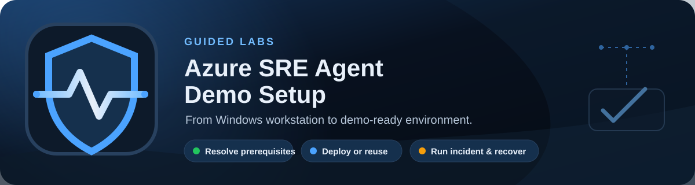

# Azure SRE Agent Demo Setup

A Windows-first local web application for deploying and running an
[Azure SRE Agent](https://learn.microsoft.com/azure/sre-agent/) demonstration without asking the
presenter to assemble a development toolchain or run the starter lab's Bash scripts.

The app packages the
[Grubify starter lab](https://github.com/microsoft/sre-agent/tree/main/labs/starter-lab) and the
multi-scenario Zava Learning lab into a guided six-step experience. It resolves each lab's
dependencies, guides device-code authentication, deploys or reuses a lab, starts demo incidents,
and restores or removes the environment.

## What is included

| Capability | Current behavior |
| --- | --- |
| Supported host | Windows 11 |
| User interface | Local web app at `http://127.0.0.1:8765` |
| Runtime | Python standard library; Python 3.14.7 is bundled in the portable package |
| Azure tools | Private, per-user Azure CLI 2.90.0 and Azure Developer CLI 1.32.0 installs |
| Labs | Grubify Starter Lab and Zava Learning |
| Typical turnaround | Approximately 10-23 minutes for Grubify or 25-45 minutes for Zava |
| Demo scenarios | Grubify memory leak plus eight Zava network, edge, app, database, secret, and VM scenarios |

Git, Git Bash, Node.js, Rust, Docker Desktop, and administrator access are not required for the
core portable experience. Zava additionally requires PowerShell 7, which the app can install
privately.

## Requirements

- Windows 11 with PowerShell and internet access.
- An Azure subscription where the signed-in user can create resources and role assignments. The
  **Owner** role at subscription scope is the simplest supported configuration.
- Access to Azure SRE Agent in the selected subscription and deployment region.
- Microsoft Edge is optional, but required to use the work/personal profile selector for Azure links.

The deployment creates billable Azure resources. Tear down the lab when it is no longer needed.

## Legal and project status

This is an independent personal project. It is not an official Microsoft product and is not
approved, owned, endorsed, or supported by Microsoft. It is intended for demonstration use and is
provided as-is.

Running the demo creates billable Azure resources. You are responsible for securing the deployed
environment, monitoring its use and cost, and deleting resources when finished. Microsoft names and
trademarks are governed by the
[Microsoft Trademark & Brand Guidelines](https://www.microsoft.com/legal/intellectualproperty/trademarks).

Review the [MIT License](LICENSE), [third-party notices](THIRD-PARTY-NOTICES.txt),
[security policy](SECURITY.md), [support policy](SUPPORT.md), and
[Code of Conduct](CODE_OF_CONDUCT.md) before using or contributing to the project. The MIT License
does not replace the separate licenses that apply to redistributed third-party components.

## Run the portable app

1. Obtain `AzureSREAgentDemo-portable-win-x64.zip` from a trusted build of this repository.
2. Extract the entire ZIP to a writable local folder. Do not run it from inside the ZIP.
3. Double-click **Start Azure SRE Agent Demo.cmd**.
4. Use **Shutdown** in the app when finished. If the browser is closed without using Shutdown, the
   backend exits automatically after its client timeout once active work has completed.

The portable package contains Python and the vendored lab. On the Prerequisites step, **Resolve all
dependencies** downloads pinned Azure CLI and azd ZIPs, verifies their SHA-256 hashes, and installs
them under:

```text
%LOCALAPPDATA%\AzureSREAgentDemo\tools
```

These private installs do not change the machine PATH and do not require elevation. If Python cannot
validate GitHub's certificate chain while downloading azd, the app retries through PowerShell so
Windows' trusted certificate store is used; certificate validation is never disabled.

## The six-step workflow

1. **Lab Picker** — Select Grubify or Zava Learning and review its dependency, resource, scenario,
   and timing metadata.
2. **Prerequisites** — Detect Azure CLI and azd, then install or update only the missing dependencies.
   The minimum supported versions are Azure CLI 2.88.0 and azd 1.28.0.
3. **Sign in** — Complete device-code authentication for both CLIs, then select the Azure tenant and
   subscription to use.
4. **Configure** — Scan for an existing compatible lab or configure a new environment. Zava exposes
   separate workload, PostgreSQL, and SRE Agent regions plus optional external integrations.
5. **Deploy** — Reuse a healthy environment, update an incomplete one, or deploy all infrastructure
   and post-provision configuration for a new lab. Progress and command output stream in the app.
6. **Demo** — Open lab-specific resources, run a supported scenario, follow Azure Monitor and SRE
   Agent progress, restore the baseline, or tear down an app-managed environment.

Device codes are copied and their verification pages are opened automatically. The app never asks
for Azure passwords.

### Existing environments

The app discovers current environments through the resource-group tags
`sre-agent-demo-lab-id` and `sre-agent-demo-environment`. It can also structurally recognize a
compatible older starter-lab deployment that predates those tags.

- A healthy, app-managed environment can be reused without redeployment and remains eligible for
  teardown.
- An incomplete or drifted managed environment is routed through an update.
- A structurally discovered legacy environment can be validated and reused, but app-assisted
  teardown is disabled because the app cannot prove ownership.

### Demo and recovery

The Memory Leak scenario sends sustained cart requests until Grubify produces the alert-triggering
HTTP or connection failures. The four-minute countdown starts only after that failure is confirmed.

Azure Monitor incident ingestion can span agents in the same subscription. To keep parallel labs
isolated, each response plan filters on that environment's exact HTTP 5xx alert title. Environments
created with an older build should run **Restore baseline** once to repair a broad or stale response
plan.

**Restore baseline** reapplies the declared infrastructure, application images, SRE Agent
configuration, knowledge base, incident-handler subagent, and response plan. Use it after a demo or
when validation reports drift. It does not delete the environment.

Step 6 can open Azure links in the current browser context or in a selected local Microsoft Edge
profile. Profiles are displayed by name and account email, while the resource group and SRE Agent
links display their resource names rather than long URLs.

### Zava Learning

Zava Learning deploys an online learning platform with private data services, eleven Container
Apps across two environments, Application Gateway, PostgreSQL, Key Vault, a reporting VM,
monitoring, symptom-based alerts, and an autonomous Azure SRE Agent. Its scenarios cover NSG
connectivity, Application Gateway probes, app scale-to-zero, slow releases, database query and
connection-pool failures, invalid secrets, and reporting-worker disk pressure.

Core SRE Agent configuration includes the Application Insights, Log Analytics, and Microsoft Learn
connectors; four custom agents; all fourteen Zava skill manifests; architecture/reporting knowledge;
the autonomous response plan; three weekly governance audits; and a daily baseline keepalive.
PagerDuty and ServiceNow connectors and the two ServiceNow custom tools are added only when their
optional credentials are supplied.

Azure Monitor and Azure SRE Agent are the core path. PagerDuty and ServiceNow can be configured
for a new Zava environment, while GitHub OAuth is connected in the SRE Agent portal after
deployment. Optional credentials are held only while their connector or protected tool is created;
they are never stored in local app state or diagnostics, and the SRE Agent retains the resulting
connection.

#### Optional integration setup

| Integration | What to prepare | Official setup resources |
| --- | --- | --- |
| PagerDuty | A service with a Microsoft Azure integration URL, a **User API key**, the P-prefixed service ID, and the API-key owner's email | [Create an account](https://signup.pagerduty.com/), [Azure integration](https://www.pagerduty.com/docs/guides/azure-integration-guide/), [API keys](https://support.pagerduty.com/docs/api-access-keys), [SRE Agent PagerDuty setup](https://learn.microsoft.com/azure/sre-agent/set-up-pagerduty-indexing) |
| ServiceNow | An instance URL and API-capable user. For a disposable lab, request a free Personal Developer Instance and use its generated admin credentials. | [Developer portal](https://developer.servicenow.com/), [Request a PDI](https://developer.servicenow.com/print_page.do?category=developer-program&identifier=obtaining-a-pdi&module=guide), [SRE Agent Python tools](https://learn.microsoft.com/azure/sre-agent/python-code-execution#python-tools-vs-mcp-connectors) |
| GitHub | Repository access through an SRE Agent GitHub OAuth or PAT connector | [GitHub connector setup](https://learn.microsoft.com/azure/sre-agent/setup-github-connector), [Connect source code](https://learn.microsoft.com/azure/sre-agent/connect-source-code) |

The original Zava `configure-agent.mjs` script does not establish GitHub OAuth. It reads
`GITHUB_REPO`, substitutes that repository into the `pr-delivery` skill, and enables tools such as
`FindConnectedGitHubRepo` and `GetIaCForGitHub`. A GitHub connector must still be created separately
under **Builder > Connectors** in the SRE Agent portal before that workflow can access a repository.

## What the lab deploys

The vendored Scenario 1 infrastructure includes:

- Azure Container Registry
- Azure Container Apps environment
- Grubify frontend and API container apps
- Log Analytics workspace and Application Insights
- Managed identity and required role assignments
- Azure SRE Agent
- Environment-specific HTTP 5xx alert rule
- Grubify runbook and architecture knowledge
- Incident-handler subagent and isolated response plan

Post-provision operations that the upstream lab performs in shell scripts are implemented directly
in `app\main.py`, including container image builds, CORS configuration, knowledge upload, subagent
creation, and response-plan creation.

## Diagnostics, cleanup, and uninstall

Use **Download diagnostic log** in the app footer when troubleshooting. Logs are also written to:

```text
%LOCALAPPDATA%\AzureSREAgentDemo\logs
```

The logs redact authentication tokens and other sensitive command output covered by the app's
diagnostic filters.

### Test mode

Test mode is off by default. It adds a clearly labeled **Skip validation** action for a selected
existing lab and bypasses only designated nonessential stabilization delays. The skip action
requires confirmation and records the environment as `skipped`, not validated. Normal validation
still performs all control-plane, running-state, ready-revision, endpoint, SRE Agent data-plane,
and alert checks in test mode.

Enable it for the current user by creating:

```text
%LOCALAPPDATA%\AzureSREAgentDemo\config.ini
```

```ini
[application]
test_mode = true
```

Or enable it for one source run:

```powershell
.\scripts\start.cmd --test-mode
```

The portable launcher also accepts the option:

```powershell
& ".\app\Start Azure SRE Agent Demo.cmd" --test-mode
```

Command-line mode options take precedence over the INI file. `--test-mode` enables the mode and
`--no-test-mode` disables it even when the INI setting is `true`. Use `--config <path>` to read a
different INI file. The startup diagnostic log records the effective mode and configuration path;
when active, the UI displays a persistent **Test mode** badge.

To remove a managed Azure environment, use **Tear down Azure resources** before uninstalling the
app. Deleting the local package does not delete anything in Azure.

To uninstall locally:

1. Shut down the app.
2. Delete the extracted portable-package folder.
3. Delete `%LOCALAPPDATA%\AzureSREAgentDemo` to remove managed CLIs, cached environment metadata,
   logs, and local application state.

## Run from source

Source development requires Git and Python 3.14.7 or newer. The application itself has no third-party
Python packages.

```powershell
git clone https://github.com/BenMagazino/Azure-SRE-Demo-App.git
cd Azure-SRE-Demo-App
.\scripts\start.cmd
```

If the required Python runtime is missing, `scripts\start.ps1` uses WinGet to install Python 3.14.7
for the current user. Azure CLI and azd are still managed through the app's Prerequisites step.

Run the automated tests:

```powershell
python -m unittest discover -s app\tests -p "test_*.py"
node --check app\static\app.js
```

Build the self-contained Windows package:

```powershell
powershell -NoProfile -ExecutionPolicy Bypass -File .\scripts\build-windows.ps1
```

The build output is:

```text
dist\AzureSREAgentDemo-portable-win-x64.zip
```

## Contributing and releases

Development uses a protected `main` branch and short-lived, developer-owned branches such as
`benmagazino/feature/42-edge-profile-picker`. Pull requests run validation and produce a temporary
Windows package artifact. Stable semantic-version tags such as `v0.1.0` build and publish the ZIP
and its SHA-256 checksum as a GitHub Release.

See [CONTRIBUTING.md](CONTRIBUTING.md) for the branch convention, pull request process, community
guidelines, and release procedure.

## Project structure

```text
app\
  main.py                  Local HTTP server and Azure workflow
  static\                  Dependency-free HTML, CSS, and JavaScript UI
  tests\test_main.py       Backend and workflow test suite
packaging\windows\         Portable launchers, splash screen, and end-user notes
scripts\
  start.cmd / start.ps1    Source launcher and Python bootstrap
  build-windows.ps1        Portable ZIP builder
vendor\starter-lab\        Vendored Grubify application, Bicep, and SRE configuration
vendor\zava-learning\      Vendored Zava platform, scenarios, and SRE configuration
```

The application binds only to loopback. Azure operations run as child processes using the selected
Azure CLI and azd sessions; no hosted control plane or separate application account is involved.
